# Digital Inclusion Assessment System — Nyarugunga Sector

Bilingual USSD digital-inclusion survey → MySQL → rule-based scorer → officials' dashboard.

## Requirements
- PHP 8.x with `pdo_mysql`
- MySQL 8

Install (Ubuntu): `sudo apt install mysql-server php8.3-mysql && sudo systemctl start mysql && sudo phpenmod pdo_mysql`

## Setup
1. Provision the database + app user (run once, as MySQL admin):
   ```sql
   CREATE DATABASE digital_inclusion CHARACTER SET utf8mb4 COLLATE utf8mb4_unicode_ci;
   CREATE USER 'di_app'@'127.0.0.1' IDENTIFIED BY 'di_pass_2026';
   CREATE USER 'di_app'@'localhost' IDENTIFIED BY 'di_pass_2026';
   GRANT ALL PRIVILEGES ON digital_inclusion.* TO 'di_app'@'127.0.0.1';
   GRANT ALL PRIVILEGES ON digital_inclusion.* TO 'di_app'@'localhost';
   FLUSH PRIVILEGES;
   ```
   (Default MySQL `root` uses socket auth; this dedicated user lets PHP connect over TCP. Change the password in both places + `config/config.php` if you like.)
2. Create tables: `mysql -h127.0.0.1 -udi_app -pdi_pass_2026 digital_inclusion < sql/schema.sql`
3. Seed data: `php sql/seed.php`
4. Start server: `php -S localhost:8000 -t public`

## Use
- USSD simulator: http://localhost:8000/simulator.php
- Dashboard: http://localhost:8000/index.php  (login: `official` / `changeme123`)

## Screenshots

### USSD survey flow (bilingual EN/Kinyarwanda)
| Consent | Cell select | Q2 | Q3 |
| --- | --- | --- | --- |
| 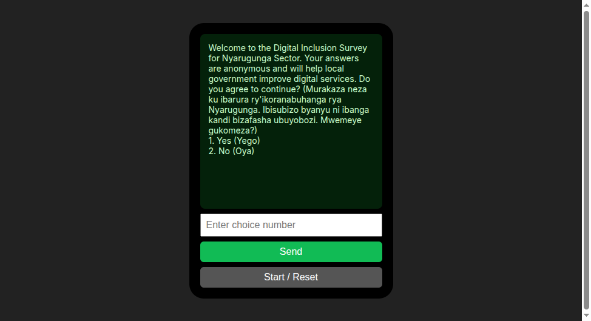 | 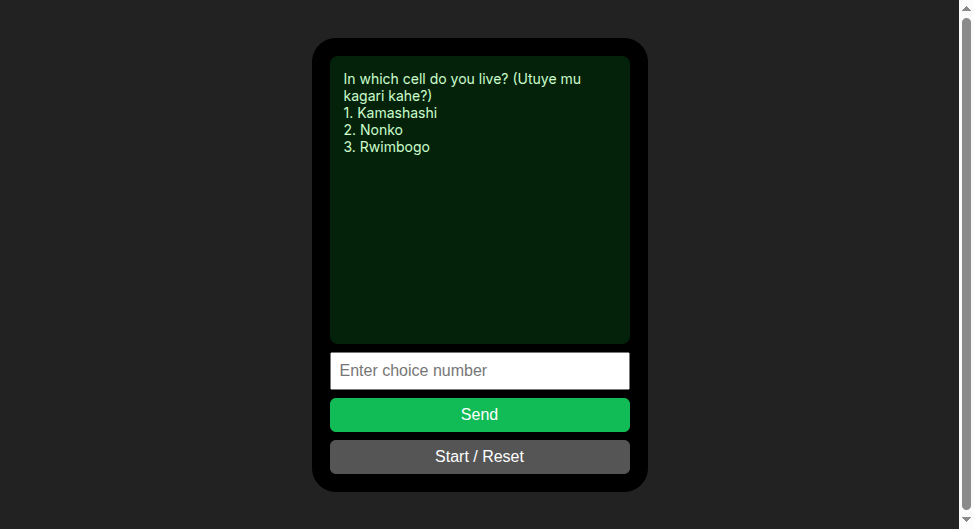 | 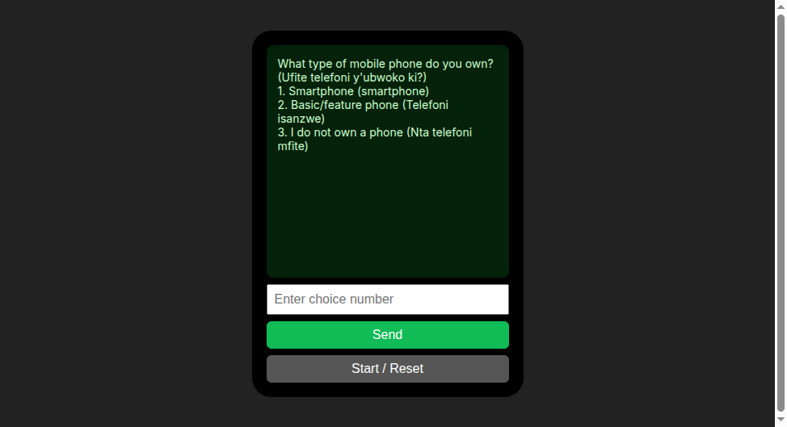 | 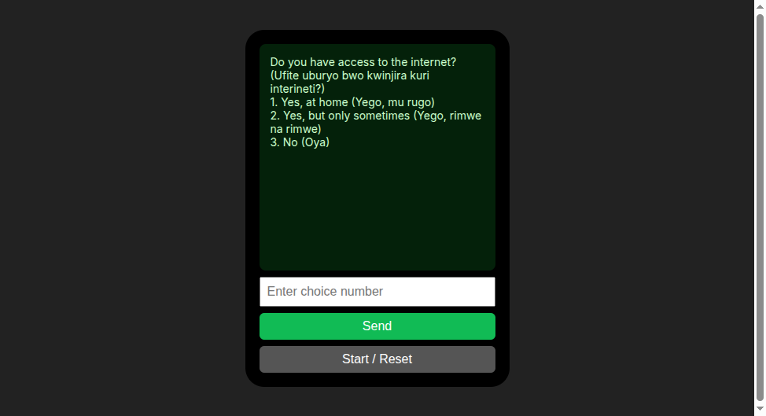 |

| Q4 | Q5 | Q6 | Q7 |
| --- | --- | --- | --- |
| 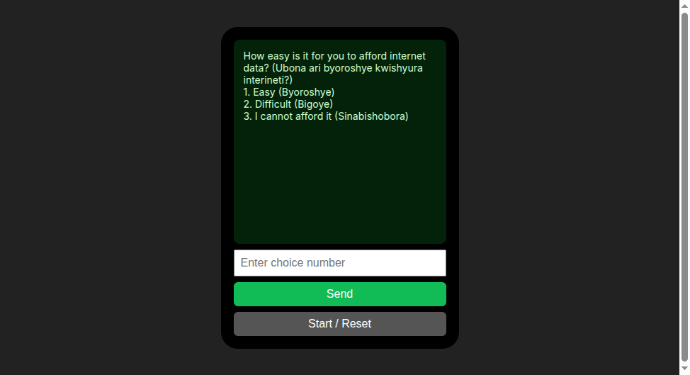 | 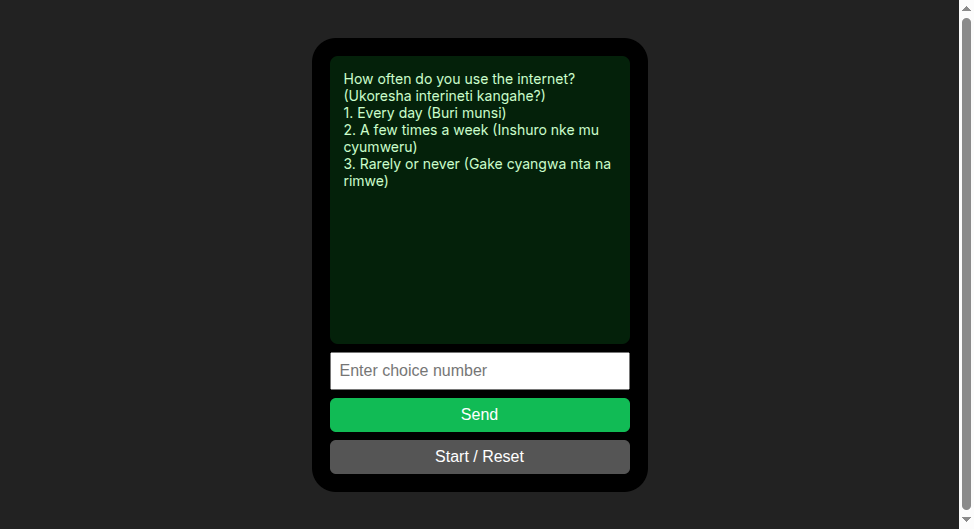 | 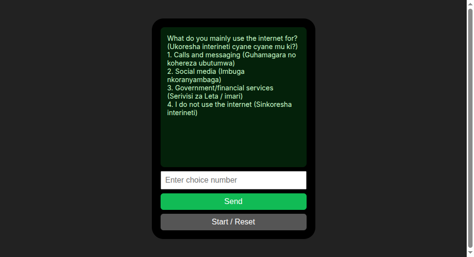 | 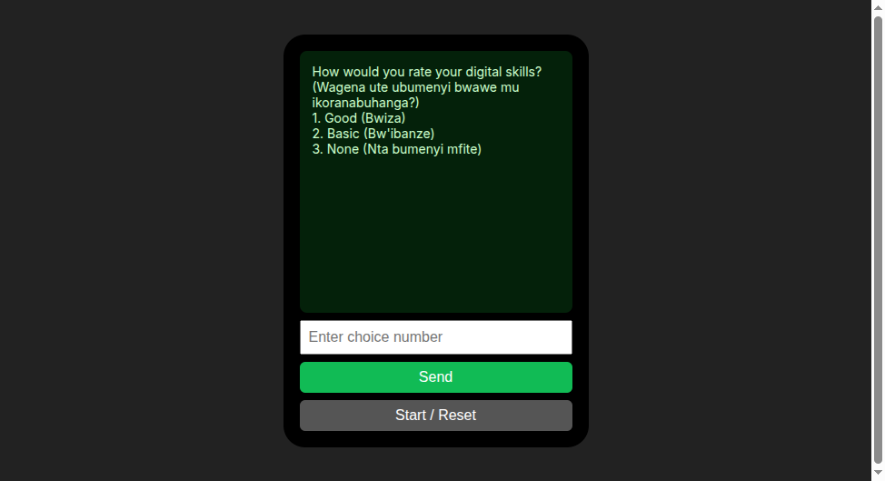 |

| Q8 | Survey complete | Consent declined |
| --- | --- | --- |
| 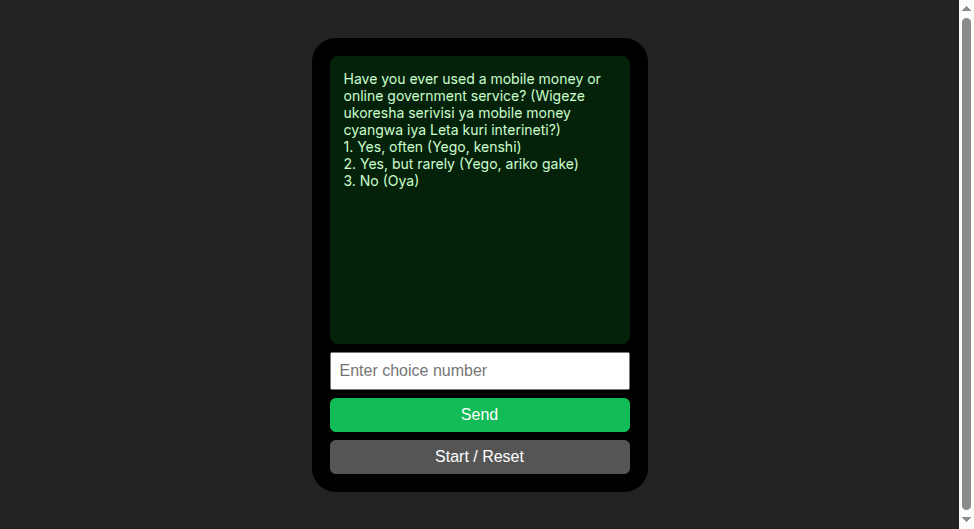 | 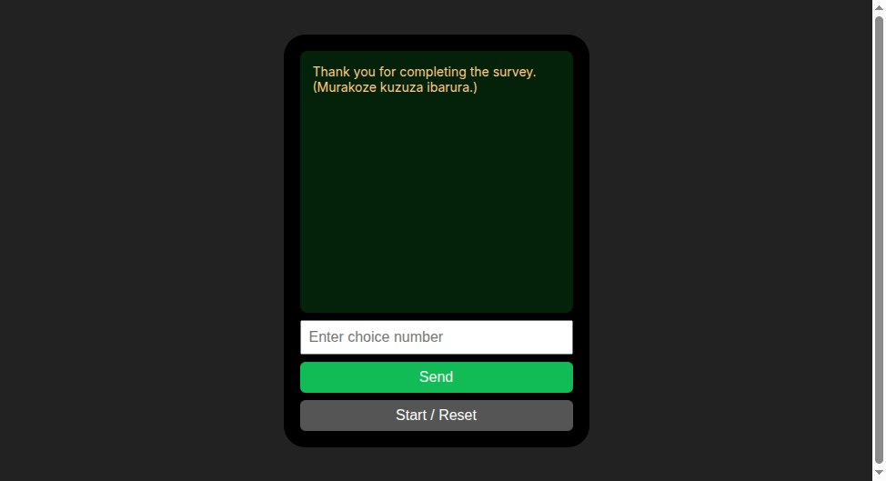 | 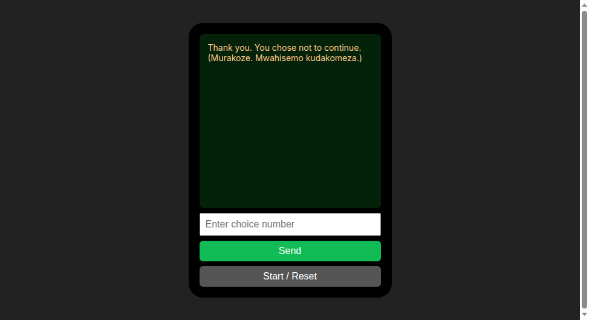 |

### Officials dashboard
| Login | Overview (KPIs + charts) |
| --- | --- |
|  | 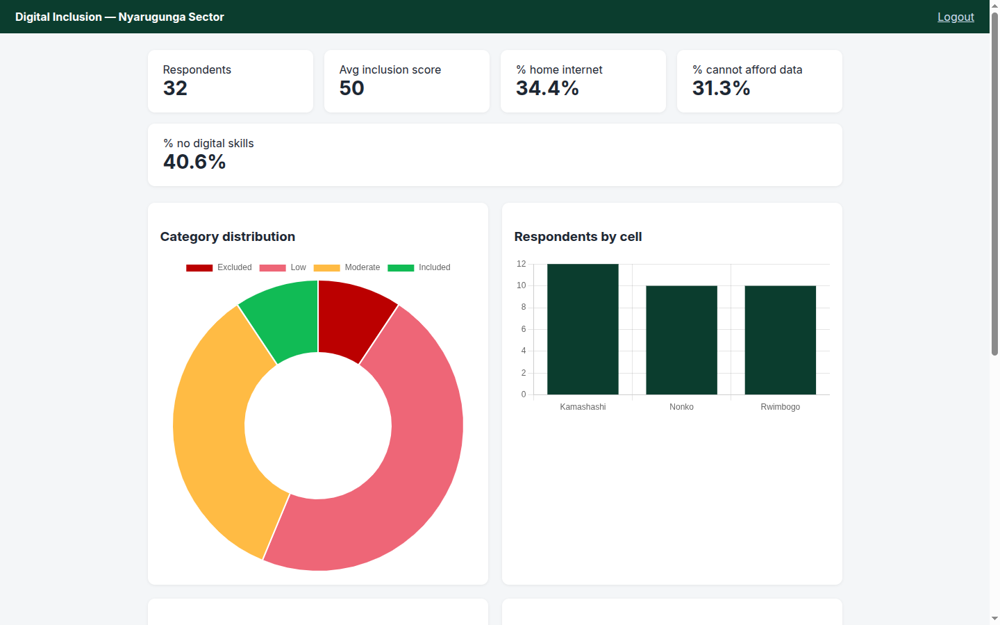 |

Full dashboard: 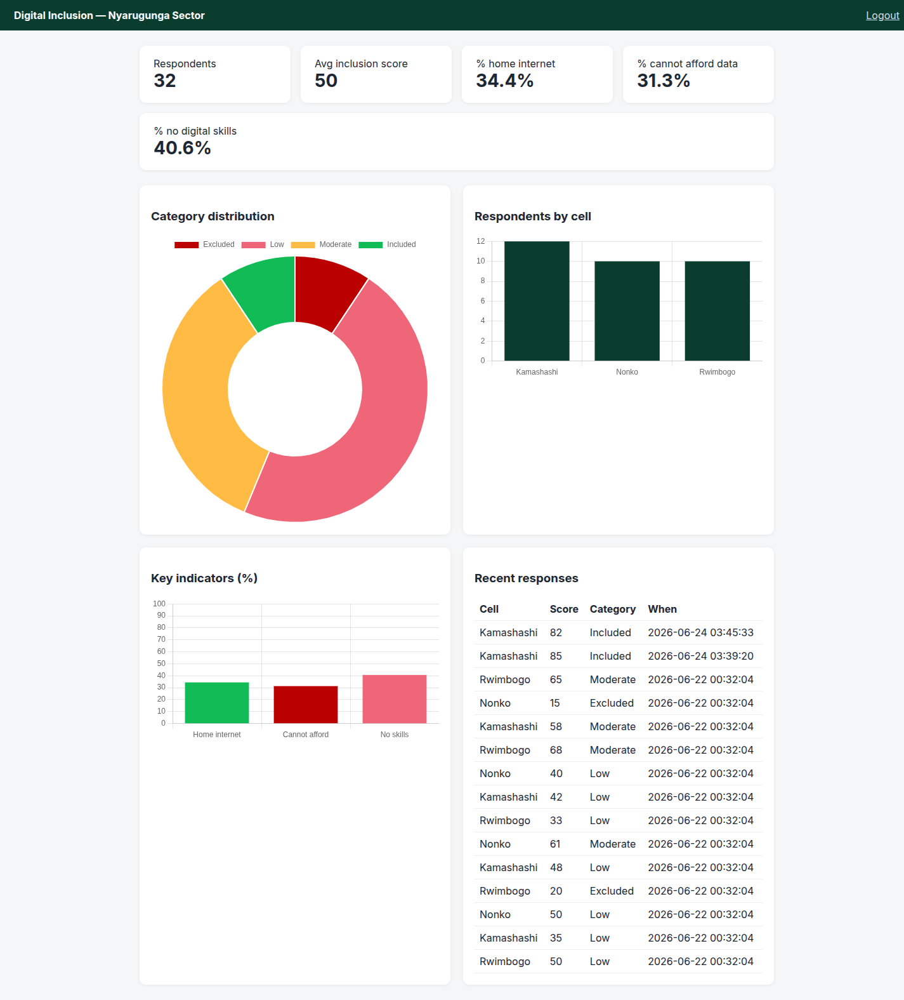

## Tests
`php tests/run.php`

## Tuning the scorer
All weights/thresholds live in `config/scoring.php` (see comment block).

## Replacing the scorer with ML
Implement `ScoreService` (`src/Score/ScoreService.php`) in a new class and swap it
in `public/ussd.php` and `sql/seed.php`. No other code changes.
